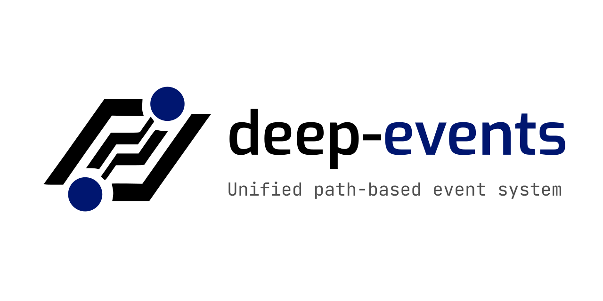

<p align="center">
  
</p>

<h1 align="center">deep-events</h1>
<p align="center">
  <em>🌳 Unified path-based event runtime for JavaScript</em>
</p>

<p align="center">
  <a href="https://www.npmjs.com/package/deep-events">
    
  </a>
  
  
  
  
</p>

<p align="center">
  One library. Every environment. Zero dependencies.<br>
  Browser, Node.js, Web Workers, Service Workers, Bun, Deno — same API everywhere.
</p>


> **⚠️ Project status: _Active development_.**  
> APIs may change without notice until we reach v1.0.  
> Use at your own risk and please report issues!


## Table of Contents
1. [What is deep-events?](#-what-is-deep-events)
2. [Why deep-events?](#-why-deep-events)
3. [Features](#-features)
4. [Installation](#-installation)
5. [Quick Start — Node.js](#-quick-start--nodejs)
6. [Quick Start — Browser](#-quick-start--browser)
7. [Core API](#-core-api)
8. [DOM Binding (Browser)](#-dom-binding-browser)
9. [Workers & Mounts (Server)](#-workers--mounts-server)
10. [Architecture Layers](#-architecture-layers)
11. [Performance](#-performance)
12. [Roadmap](#-roadmap)
13. [Sponsors](#-sponsors)
14. [Contact](#-contact)
15. [License](#-license)


## 🌳 What is deep-events?

**deep-events** is a path-based event runtime that unifies events, state, DOM binding, cross-worker messaging, and lifecycle cleanup under a single API.

Everything is a **path**. The path is the identity, the scope, and the lifecycle.

```js
// Listen
ev.on('/chat/room-42', ['message'], function(e) {
    e.data.text;
});

// Emit
ev.emit('/chat/room-42', 'message', { text: 'hello' });

// Room closes — one line kills everything.
// Listeners, timers, state, pending requests. Zero leaks.
ev.clear('/chat/room-42/**');
```

Paths form a **tree**. When you clear a path, everything attached to it — listeners, timers, state, pending requests — is gone. No manual tracking, no forgotten intervals, no ghost listeners.


## 💡 Why deep-events?

Every app eventually builds the same plumbing: events between modules, state management, DOM binding, cross-worker messaging, cleanup on navigation. Each solved by a different library with a different API.

deep-events replaces all of them with **one primitive: paths**.

| Problem | Traditional approach | deep-events |
|---|---|---|
| Events between modules | EventEmitter / mitt / custom | `ev.on` / `ev.emit` on paths |
| State management | Redux / Zustand / signals | `ev.state` on paths |
| DOM event binding | addEventListener + manual cleanup | `ev.dom` — path-owned, auto-cleanup |
| Cross-worker messaging | postMessage + manual routing | `ev.mount` — transparent routing |
| Request/response | Custom callbacks / promises | `ev.ask` / `e.reply` on paths |
| Cleanup on navigation | componentWillUnmount / manual lists | `ev.clear('/page/**')` — one line |
| Timers that leak | setInterval + clearInterval | `ev.interval` — path-owned, dies with clear |

The key insight: **paths already describe your app's structure**. Pages, components, services, workers — they all have a natural hierarchy. deep-events makes that hierarchy the runtime itself.


## ✨ Features

- **Zero Dependencies**  
  No external packages. Ships as a single file. Optional `cbor-x` only for child process mounts.

- **Same API Everywhere**  
  Browser, Node.js, Web Workers, Service Workers, Worker Threads, Bun, Deno. Write once, run anywhere.

- **Zero Leaks by Design**  
  `ev.clear('/page/**')` kills listeners, timers, state, and pending requests. No manual tracking.

- **Built-in State**  
  Per-path state with shallow merge, change detection, and `e.data.prev` for previous values.

- **Ask / Reply**  
  Request-response over the bus. First reply wins. Timeout, error codes, and lifecycle binding built in.

- **DOM Binding**  
  One API for events AND observers (resize, scroll, visibility, element lifecycle). All path-owned.

- **6 Mount Types**  
  Worker threads, child processes, MessagePort, require, import, sandboxed VM. From full isolation to zero overhead.

- **Blue-Green Reload**  
  Zero-downtime hot reload for workers. New version boots, old version drains, zero dropped requests.

- **Callback-First**  
  No async/await, no promises in core. ES5 compatible. Works everywhere, even legacy browsers.

- **Write Once, Respond Anywhere**  
  Same `ev.ask` call works on server and client. Who answers depends on what's loaded — not on directives.


## 📦 Installation

### Node.js

```bash
npm install deep-events
```

```js
var ev = require('deep-events');
```

> **Singleton** — every `require('deep-events')` in every file returns the same instance.  
> The bus IS the glue between modules. No need to pass references around.

### Browser

```html
<script src="deep-events.min.js"></script>
<script>
    // ev is available globally
    ev.on('/app', ['ready'], function(e) {
        console.log('App is ready!');
    });
</script>
```

> 📂 Browser bundles ship in three flavors: **tab**, **service worker**, and **web worker** — each includes only what's needed for that environment.


## 🟢 Quick Start — Node.js

A simple service that handles requests on the bus:

```js
var ev = require('deep-events');

// Register a service
ev.on('/services/greet', ['hello'], function(e) {
    e.reply({ message: 'Hello, ' + e.data.name + '!' });
});

// Call the service from anywhere
ev.ask('/services/greet', 'hello', { name: 'Dan' }, function(err, res) {
    console.log(res.data.message);  // "Hello, Dan!"
});
```

Mount a worker for isolation:

```js
var ev = require('deep-events');

// Mount a worker thread — full isolation, blue-green reloadable
ev.mount('/services/db', { file: './db-worker.js' });

// Requests route transparently
ev.ask('/services/db/users', 'get', { id: 42 }, function(err, res) {
    console.log(res.data.user);
});

// Hot reload with zero downtime
ev.reload('/services/db', function(err) {
    console.log('DB worker reloaded — zero dropped requests');
});
```


## 🌐 Quick Start — Browser

```html
<script src="deep-events.min.js"></script>
<script>
    // DOM events — path-owned, auto-cleanup
    ev.dom('/ui/search', '#search-input', 'input', { debounce: 300 }, function(e) {
        console.log('Search:', e.target.value);
    });

    // State management
    ev.state('/app/user', { name: 'Dan', online: true });

    ev.on('/app/user', ['changed'], function(e) {
        console.log(e.data.changed);       // ['online']
        console.log(e.data.online);        // false
        console.log(e.data.prev.online);   // true
    });

    ev.state('/app/user', { online: false });

    // Page navigation — clear everything when leaving
    ev.clear('/page/dashboard/**');
</script>
```


## 🔧 Core API

### Events

```js
// Listen — returns a listener ID
var id = ev.on('/chat/messages', ['new', 'edit'], function(e) {
    e.data;       // payload
    e.path;       // '/chat/messages'
    e.type;       // 'new' or 'edit'
    e.source;     // 'self' | 'sw' | 'tab:123'
});

// Listen once
ev.once('/auth', ['login'], function(e) { });

// Emit
ev.emit('/chat/messages', 'new', { text: 'hello', user: 'dan' });

// Remove
ev.off(id);                 // specific listener
ev.clear('/chat/**');       // everything under a path
```

### Ask / Reply

Request-response over the bus. First reply wins, auto-stops propagation.

```js
ev.ask('/math/add', 'calc', { a: 2, b: 3 }, function(err, res) {
    if (err) return console.error(err.code);  // TIMEOUT | NO_HANDLER | ...
    console.log(res.data.sum);  // 5
});

ev.on('/math/add', ['calc'], function(e) {
    e.reply({ sum: e.data.a + e.data.b });
});
```

### State

Built-in state per path. Shallow merge. Change detection with previous values.

```js
// Set
ev.state('/app/user', { name: 'Dan', lang: 'he', online: true });

// Update (shallow merge)
ev.state('/app/user', { online: false });
// → { name: 'Dan', lang: 'he', online: false }

// Read (returns a clone, not a reference)
var user = ev.state('/app/user');

// Listen for changes
ev.on('/app/user', ['changed'], function(e) {
    e.data.online;        // false (current)
    e.data.prev.online;   // true (previous)
    e.data.changed;       // ['online']
});

// Snapshot — fire immediately with current value, then on changes
ev.on('/app/user', ['changed'], handler, { snapshot: true });
```

### Wildcards

```js
ev.on('/chat/*/messages', ['new'], handler);   // * = single level
ev.on('/chat/**', ['message'], handler);        // ** = recursive
```

### Path Scoping

Convenience shortcut for long prefixes. Auto-owns asks for cleanup.

```js
var room = ev.path('/chat/room-42');
room.on(['message'], handler);              // → /chat/room-42
room.emit('typing', { user: 'dan' });      // → /chat/room-42
room.state('users', { count: 5 });         // → /chat/room-42/users
room.ask('/api/data', 'fetch', {}, cb);    // auto-owned by room
room.timeout(fn, 5000);                    // timer owned by room

// User leaves the room — everything dies
ev.clear('/chat/room-42/**');
```

### Timers

Path-owned. Die with `ev.clear`. Reliable across background tabs and system sleep.

```js
ev.timeout('/mypath', callback, 5000);
ev.interval('/mypath', callback, 10000);

// Atomic replacement — no gap between old and new
var id = ev.timeout('/mypath', callback, 3000);
ev.timeout('/mypath', callback, 5000, { id: id });
```

### Listener Options

```js
ev.on(path, types, handler, {
    consume: true,            // remove after first trigger
    timeout: 10000,           // auto-remove after duration
    filter: fn,               // trigger only if returns true
    match: { field: value },  // fire only if data matches
    debounce: 300,            // per listener instance
    throttle: 100,            // leading mode
    priority: 1,              // execution order (1=high, 10=low)
    replace: true,            // replace existing on same path+types
    unique: true,             // skip if already exists
    snapshot: true,           // fire immediately with current state
});
```

### Error Handling

```js
// Ask errors go to the callback
ev.ask('/services/db', 'query', data, function(err, res) {
    if (err) {
        err.code;  // TIMEOUT | WORKER_DEAD | NO_HANDLER | CLEARED | ...
    }
});

// Safety net for unhandled errors (listener exceptions, late replies)
ev.onError(function(err, path, type) {
    console.error('Error at', path, ':', err.message);
});
```

### Cross-Environment Transport

```js
ev.emit('/data', 'save', payload, { to: 'sw' });          // → Service Worker
ev.emit('/data', 'sync', data, { to: 'all-tabs' });       // → all browser tabs
ev.emit('/ui/notify', 'show', data, { to: 'tab:123' });   // → specific tab
```

Automatic degradation: Service Worker → BroadcastChannel → localStorage → local only.


## 🖱️ DOM Binding (Browser)

One API for user interactions AND observers. Auto-detects the mechanism.

```js
// User interactions
ev.dom('/ui/login', '#btn', 'click', handler);
ev.dom('/ui/search', '#input', 'input', { debounce: 300 }, handler);
ev.dom('/ui/keys', document, 'keydown', { keys: { ctrl: true, key: 's' } });

// Observers — resize, scroll, visibility, element lifecycle
ev.dom('/ui/panel', element, 'resize');      // ResizeObserver
ev.dom('/ui/chat', element, 'scroll');       // scroll position tracking
ev.dom('/ui/post', element, 'visibility');   // IntersectionObserver
ev.dom('/ui/comp', '.component', 'exist');   // MutationObserver (element added)
ev.dom('/ui/comp', element, 'removed');      // MutationObserver (element removed)

// Batch observation — CSS selector watches all matching elements
// Auto-observes new elements added later
ev.dom('/feed/images', '.lazy-img', 'visibility');

// Cleanup — same as everything else
ev.clear('/ui/**');
```

### Observer Data

```js
// Scroll
e.data.fromTop;  e.data.fromBottom;  e.data.totalHeight;

// Visibility
e.data.ratio;    // 0.0–1.0
e.data.visible;  // boolean

// Resize
e.data.width;  e.data.height;  e.data.prev.width;
```

All observers auto-cleanup when the element is removed from the DOM.


## ⚙️ Workers & Mounts (Server)

Mount code to paths. Six isolation levels. Transparent routing.

```js
// Worker thread (default) — full isolation, blue-green reload
ev.mount('/services/db', { file: './db.worker.js' });

// Child process — separate PID, CBOR transport
ev.mount('/services/heavy', { file: './heavy.js', type: 'process' });

// MessagePort — external worker, you manage the lifecycle
ev.mount('/services/ext', { port: existingPort });

// In-process require — zero overhead
ev.mount('/services/utils', { file: './utils.js', type: 'require' });

// In-process import — async ESM
ev.mount('/services/esm', { file: './esm.js', type: 'import' });

// Sandboxed VM — restricted globals, for untrusted code
ev.mount('/plugins/user', { file: './plugin.js', type: 'vm' });
```

### Mount Options

```js
ev.mount('/services/db', {
    file: './db.worker.js',
    type: 'thread',           // thread | process | port | require | import | vm
    start: 'onDemand',        // boot on first ask (default: immediate)
    idle: 60000,              // shutdown after 60s of inactivity
    restart: true,            // auto-restart on crash
    maxRestarts: 3,           // stop retrying after 3 crashes
    ping: 6000,               // health check every 6s
    bootTimeout: 10000,       // max time to wait for ready signal
});
```

### Blue-Green Reload

Zero-downtime hot reload. New version boots → old version drains → no dropped requests.

```js
ev.reload('/services/db', function(err) {
    console.log('v2 is live');
});

// With verification — test before promoting
ev.reload('/services/db', { keep: true }, function(err, next) {
    next.ask('health', 'check', {}, function(err, res) {
        res.data.ok ? next.promote() : next.kill();
    });
});
```

### Write Once, Respond Anywhere

```js
// render.js — this file runs on BOTH server and client
ev.ask('services/content', 'load', { url: '/data.json' }, function(err, res) {
    // Server: http_content.js answered (read from disk)
    // Browser: content_provider.js answered (fetch from network)
    // The caller doesn't know or care.
});
```

No `'use client'`. No `'use server'`. The path is the interface — the implementation is swappable.

### Platform APIs

All queryable as state. All path-owned.

```js
ev.on('/system/network', ['changed'], function(e) {
    e.data.online;  e.data.type;  e.data.quality;
});

ev.on('/system/battery', ['changed'], function(e) {
    e.data.level;  e.data.charging;  e.data.prev.level;
});

ev.on('/system/page', ['visibility'], function(e) {
    e.data.state;  // 1=active, 2=passive, 3=hidden, 4=frozen, 5=terminated
});

// Query current state anytime — no need to listen first
var net = ev.state('/system/network');
if (net.online) { /* ... */ }
```


## 🏗️ Architecture Layers

deep-events is built in layers. Each builds on the one below. Use only what you need.

| Layer | What | Key APIs |
|:---:|---|---|
| **1** | **Core Event Bus** — events, ask/reply, state, timers, clear | `ev.on`, `ev.emit`, `ev.ask`, `ev.state`, `ev.clear` |
| **2** | **Transport** — cross-context routing (tabs, workers, SW) | `{ to: 'sw' }`, `{ to: 'all-tabs' }` |
| **3** | **DOM** — unified events + observers, path-owned | `ev.dom` |
| **4** | **Platform APIs** — system state (network, battery, GPS...) | `/system/*` paths |
| **5** | **State** — per-path state, persistence, sync | `ev.state` with `{ persist, sync }` |
| **6** | **Workers & Mounts** — 6 mount types, blue-green reload | `ev.mount`, `ev.reload`, `ev.unmount` |
| **7** | **Client Services** — SPA navigation, render pipeline | `page_manager`, `render`, `content_provider` |


## ⚡ Performance

| Operation | Browser | Server |
|---|---|---|
| emit (single listener) | >1M/sec | >5M/sec |
| emit (wildcard) | >500K/sec | >1M/sec |
| clear (100 listeners) | <1ms | <0.5ms |
| cross-boundary ask/reply (sequential) | — | ~8K/sec |
| cross-boundary ask/reply (concurrent) | — | ~87K/sec |
| cross-boundary 4KB zero-copy transfer | — | ~12.6K/sec |

Zero allocations on the emit hot path (event object pool on server).


## 🛣 Roadmap

✅ = Complete  🔄 = In Progress  ⏳ = Planned

### ✅ Complete

| Status | Item |
|:---:|---|
| ✅ | Core event bus — on, emit, off, clear, wildcards |
| ✅ | Ask / reply with correlation IDs |
| ✅ | State engine — shallow merge, change detection, prev |
| ✅ | Timer system — path-owned, atomic replace, reliable |
| ✅ | Path scoping with auto-owner |
| ✅ | Worker mounts — thread, process, port, require, import, vm |
| ✅ | Blue-green reload with drain |
| ✅ | Graceful shutdown with sub-mount lifecycle |
| ✅ | Ping/pong health checks |
| ✅ | CBOR framing for child process transport |
| ✅ | Declarative mount management (mount_loader + JSON) |
| ✅ | Client services — page_manager, render, content_provider, murl |

### 🔄 In Progress

| Status | Item | Notes |
|:---:|---|---|
| 🔄 | Browser transport layer | SW, BroadcastChannel, fallback chain |
| 🔄 | ev.dom — events + observers | Events, resize, scroll, visibility, lifecycle |
| 🔄 | Platform APIs | /system/network, battery, GPS, display |
| 🔄 | SPA router service | Route matching, guards, page lifecycle |

### ⏳ Planned

| Status | Item | Notes |
|:---:|---|---|
| ⏳ | Browser mount types | Web Worker, SharedWorker |
| ⏳ | Cross-tab state sync | Via Service Worker or BroadcastChannel |
| ⏳ | Electron mount type | BrowserWindow via ipcMain/ipcRenderer |
| ⏳ | Dev tools | `ev.debug()`, `ev.trace()`, Chrome extension |
| ⏳ | Event tracing | Cross-boundary `e.id` + `e.trace[]` |
| ⏳ | Middleware / interceptor API | — |
| ⏳ | TypeScript typings | IDE support |
| ⏳ | Framework integration | React hooks, Vue composables |
| ⏳ | Benchmarks & profiling | CPU, memory, latency |

_Community contributions welcome!_  
_Please ⭐ star the repo to follow progress._


## 🙏 Sponsors

deep-events is a passion project.  
Support development via **GitHub Sponsors** or simply share the project.


## 💬 Contact

For feedback, ideas, or contributions:  
📧 **your-email@example.com**

For security-related issues, please see [SECURITY.md](./SECURITY.md).


## 📜 License

**MIT**

```
Copyright © 2025 Your Name

Permission is hereby granted, free of charge, to any person obtaining a copy
of this software and associated documentation files (the "Software"), to deal
in the Software without restriction, including without limitation the rights
to use, copy, modify, merge, publish, distribute, sublicense, and/or sell
copies of the Software, and to permit persons to whom the Software is
furnished to do so, subject to the following conditions:

The above copyright notice and this permission notice shall be included in all
copies or substantial portions of the Software.

THE SOFTWARE IS PROVIDED "AS IS", WITHOUT WARRANTY OF ANY KIND, EXPRESS OR
IMPLIED, INCLUDING BUT NOT LIMITED TO THE WARRANTIES OF MERCHANTABILITY,
FITNESS FOR A PARTICULAR PURPOSE AND NONINFRINGEMENT. IN NO EVENT SHALL THE
AUTHORS OR COPYRIGHT HOLDERS BE LIABLE FOR ANY CLAIM, DAMAGES OR OTHER
LIABILITY, WHETHER IN AN ACTION OF CONTRACT, TORT OR OTHERWISE, ARISING FROM,
OUT OF OR IN CONNECTION WITH THE SOFTWARE OR THE USE OR OTHER DEALINGS IN THE
SOFTWARE.
```
